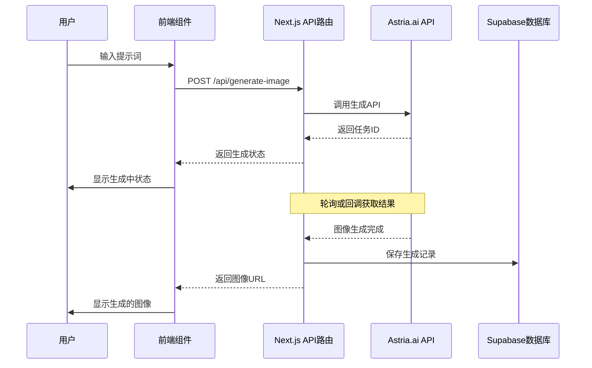

# Astria.ai 文生图 API 使用指南

基于 [Astria.ai API 文档](https://docs.astria.ai/docs/api/prompt/create/) 整理

## 概述

Astria.ai 提供了强大的文生图 API 服务，支持通过文本描述生成高质量的 AI 图像。该 API 基于深度学习模型，支持多种图像生成功能和定制选项。

## API 基本信息

- **基础 URL**: `https://api.astria.ai`
- **认证方式**: Bearer Token
- **请求方式**: POST
- **端点**: `/tunes/:id/prompts`

## 认证

在所有请求中需要在 Header 中包含 API 密钥：

```bash
Authorization: Bearer YOUR_API_KEY
```

## 核心功能

### 1. 基础文生图

**端点**: `POST /tunes/:id/prompts`

#### 必需参数

| 参数 | 类型 | 描述 |
|------|------|------|
| `text` | string | 图像描述文本（提示词） |

#### 主要可选参数

| 参数 | 类型 | 默认值 | 描述 |
|------|------|--------|------|
| `negative_prompt` | string | - | 负面提示词，逗号分隔的不希望出现的内容 |
| `num_images` | integer | 1 | 生成图像数量（1-8） |
| `seed` | integer | 随机 | 随机种子（0 到 2^32） |
| `w` | integer | - | 图像宽度（8的倍数） |
| `h` | integer | - | 图像高度（8的倍数） |
| `cfg_scale` | float | - | 提示词遵循程度（0-15） |
| `steps` | integer | - | 扩散步数（0-50） |

#### 高级功能参数

| 参数 | 类型 | 描述 |
|------|------|------|
| `super_resolution` | boolean | 4倍超分辨率 |
| `face_correct` | boolean | 面部修正 |
| `face_swap` | boolean | 面部替换 |
| `inpaint_faces` | boolean | 面部修复（需要超分辨率） |
| `hires_fix` | boolean | 高分辨率细节增强 |
| `film_grain` | boolean | 添加胶片噪点 |

#### 风格参数

| 参数 | 可选值 |
|------|--------|
| `style` | `Cinematic`, `Animated`, `Digital Art`, `Photographic`, `Fantasy art`, `Neonpunk`, `Enhance`, `Comic book`, `Lowpoly`, `Line art` |
| `color_grading` | `Film Velvia`, `Film Portra`, `Ektar` |
| `scheduler` | `euler`, `euler_a`, `dpm++2m_karras`, `dpm++sde_karras`, `dpm++2m`, `dpm++sde`, `lcm`, `tcd` |

### 2. ControlNet 功能

支持基于输入图像的控制生成：

| 参数 | 描述 |
|------|------|
| `controlnet` | 控制类型：`composition`, `reference`, `segroom`, `ipadapter`, `lineart`, `canny`, `depth`, `mlsd`, `hed`, `pose`, `tile`, `qr` |
| `input_image` | 输入图像（二进制文件） |
| `input_image_url` | 输入图像URL |
| `denoising_strength` | 去噪强度（0.0-1.0） |
| `controlnet_conditioning_scale` | ControlNet 条件强度（0.0-1.0） |

### 3. 图像修复（Inpainting）

| 参数 | 描述 |
|------|------|
| `mask_image` | 遮罩图像（二进制文件） |
| `mask_image_url` | 遮罩图像URL |

## 调用示例

### cURL 示例

```bash
curl -X POST -H "Authorization: Bearer $API_KEY" https://api.astria.ai/tunes/1/prompts \
  -F prompt[text]="a painting of ohwx man in the style of Van Gogh" \
  -F prompt[negative_prompt]="old, blemish, wrinkles" \
  -F prompt[super_resolution]=true \
  -F prompt[face_correct]=true \
  -F prompt[num_images]=2
```

### Node.js 示例

```javascript
const fetch = require('node-fetch');
const FormData = require('form-data');

const API_URL = 'https://api.astria.ai/tunes/1/prompts';
const API_KEY = 'YOUR_API_KEY';

const form = new FormData();
form.append('prompt[text]', 'a beautiful landscape with mountains and lake');
form.append('prompt[negative_prompt]', 'blurry, low quality');
form.append('prompt[num_images]', 1);
form.append('prompt[style]', 'Photographic');
form.append('prompt[super_resolution]', true);

const response = await fetch(API_URL, {
  method: 'POST',
  headers: {
    'Authorization': `Bearer ${API_KEY}`
  },
  body: form
});

const result = await response.json();
console.log(result);
```

### Python 示例

```python
import requests

API_URL = 'https://api.astria.ai/tunes/1/prompts'
API_KEY = 'YOUR_API_KEY'

headers = {
    'Authorization': f'Bearer {API_KEY}'
}

data = {
    'prompt[text]': 'a cute cartoon cat playing in a garden',
    'prompt[negative_prompt]': 'scary, dark, ugly',
    'prompt[num_images]': 1,
    'prompt[style]': 'Animated',
    'prompt[super_resolution]': True,
    'prompt[w]': 512,
    'prompt[h]': 512
}

response = requests.post(API_URL, headers=headers, data=data)
result = response.json()
print(result)
```

## 响应格式

成功请求返回的 JSON 格式：

```json
{
  "id": 1,
  "text": "a painting of ohwx man in the style of Van Gogh",
  "negative_prompt": "old, blemish, wrinkles",
  "cfg_scale": null,
  "steps": null,
  "seed": null,
  "created_at": "2022-10-06T16:12:54.505Z",
  "updated_at": "2022-10-06T16:12:54.505Z",
  "tune_id": 1,
  "url": "http://api.astria.ai/tunes/1/prompts/1.json"
}
```

## 回调机制

支持设置回调 URL，当图像生成完成时会自动通知：

```bash
-F prompt[callback]="https://your-website.com/webhook/astria"
```

## 收费策略与建议配置

### 收费标准 (2024年)
- **Flux 模型**: $0.23/8张图片 = **$0.029/张**
- **Stable Diffusion 模型**: $0.10/8张图片 = **$0.0125/张**
- **附加功能**: 超分辨率/面部修正 **$0.0125/张**

### 推荐生成数量配置
根据成本效益分析，建议按以下策略配置：

#### 🎯 默认配置 (推荐)
- **生成数量**: `1张` 
- **原因**: 平衡成本与用户体验，单张$0.029对用户较为友好
- **适用场景**: 普通用户日常使用

#### 💎 高级配置 (可选)
- **生成数量**: `2-4张`
- **原因**: 为用户提供更多选择，但成本增加至$0.058-$0.116
- **适用场景**: 付费用户或重要项目

#### ⚠️ 不推荐
- **生成数量**: `5张以上`
- **原因**: 成本过高 (>$0.145)，用户体验下降
- **风险**: 可能导致用户流失

### 可配置的后台参数

#### 🔧 基础生成参数
| 参数 | 建议值 | 用户可见 | 描述 |
|------|--------|----------|------|
| `num_images` | 1-4 | ✅ | 生成图片数量 |
| `w` | 512/768/1024 | ✅ | 图像宽度 |
| `h` | 512/768/1024 | ✅ | 图像高度 |
| `style` | 见风格列表 | ✅ | 艺术风格 |
| `negative_prompt` | 预设/自定义 | ✅ | 负面提示词 |

#### ⚙️ 技术参数 (后台管理)
| 参数 | 推荐值 | 调整建议 |
|------|--------|----------|
| `cfg_scale` | 3.5 (Flux) / 7-12 (SD) | 根据模型类型自动调整 |
| `steps` | 20-25 | 平衡质量与生成时间 |
| `seed` | 随机 | 可提供固定种子选项 |
| `scheduler` | `dpm++2m_karras` | 推荐调度器 |

#### 🎨 高级功能 (可开关)
| 功能 | 成本影响 | 建议默认值 |
|------|----------|------------|
| `super_resolution` | +$0.0125 | ✅ 开启 |
| `face_correct` | +$0.0125 | ✅ 开启 |
| `hires_fix` | 无额外费用 | ✅ 开启 |
| `film_grain` | 无额外费用 | ❌ 关闭 |
| `face_swap` | +$0.0125 | ❌ 关闭 |

### 当前图像尺寸配置

#### 📐 默认尺寸配置
- **基础尺寸**: `512×512 像素`
- **开启超分辨率后**: `1024×1024 像素` ⭐
- **实际输出**: 由于默认开启 `super_resolution: true`，最终图片为 **1024×1024**
- **适用场景**: 高质量输出、专业用途
- **生成时间**: 约30-45秒
- **质量**: 高质量，AI 4倍放大

#### 🔧 推荐尺寸配置选项
```javascript
const imageSizes = {
  'small': { w: 512, h: 512, label: '正方形 (512×512)' },
  'medium': { w: 768, h: 768, label: '中等 (768×768)' },
  'portrait': { w: 512, h: 768, label: '竖版 (512×768)' },
  'landscape': { w: 768, h: 512, label: '横版 (768×512)' },
  'large': { w: 1024, h: 1024, label: '高清 (1024×1024)' }
};
```

#### ⚡ 尺寸对生成的影响
| 基础尺寸 | 超分辨率后 | 生成时间 | 成本 | 质量 | 推荐用途 |
|----------|------------|----------|------|------|----------|
| 512×512 | **1024×1024** | 30-45秒 | 标准+$0.0125 | 🔥高质量 | **当前默认** |
| 768×768 | 1536×1536 | 45-60秒 | 标准+$0.0125 | 超高质量 | 专业用途 |
| 1024×1024 | 2048×2048 | 60-90秒 | 标准+$0.0125 | 最高质量 | 企业用途 |

**注**: 由于默认开启超分辨率，实际输出尺寸都是原尺寸的2倍

### 用户界面建议配置

#### 🎛️ 简化用户界面
```javascript
// 用户可见的简化选项
const userOptions = {
  style: ['摄影风格', '艺术风格', '动画风格', '科幻风格'],
  size: ['正方形', '竖版', '横版'],
  quality: ['标准', '高质量+超分辨率'],
  quantity: [1, 2, 4] // 根据用户等级限制
};
```

#### 🔒 高级用户选项
```javascript
// 付费用户或高级用户可见
const advancedOptions = {
  cfg_scale: '提示词遵循程度',
  steps: '生成精度',
  negative_prompt: '负面提示词',
  seed: '随机种子',
  scheduler: '生成算法'
};
```

## 最佳实践

### 1. 提示词优化
- 使用详细、具体的描述
- 包含风格、颜色、构图等细节
- 避免过于复杂的句子

### 2. 负面提示词
- 列出不希望出现的元素
- 常用: `blurry, low quality, distorted, ugly`

### 3. 参数调优
- `cfg_scale`: 7-12 范围内效果较好
- `steps`: 20-50 步通常足够
- `super_resolution`: 用于提升图像质量

### 4. 成本控制
- 合理设置 `num_images` 数量
- 根据需求选择是否开启高级功能

## 错误处理

常见错误及解决方案：

| 错误码 | 描述 | 解决方案 |
|--------|------|----------|
| 401 | 认证失败 | 检查 API 密钥是否正确 |
| 400 | 参数错误 | 检查必需参数和参数格式 |
| 429 | 请求过于频繁 | 实施请求限流 |
| 500 | 服务器错误 | 稍后重试 |

## 集成到项目中

### 环境变量配置

```bash
# .env.local
ASTRIA_API_KEY=your_api_key_here
ASTRIA_TUNE_ID=your_tune_id_here
```

### 封装 API 调用

```javascript
// lib/astria.js
export async function generateImage(prompt, options = {}) {
  const form = new FormData();
  form.append('prompt[text]', prompt);
  
  // 添加可选参数
  Object.entries(options).forEach(([key, value]) => {
    if (value !== undefined) {
      form.append(`prompt[${key}]`, value);
    }
  });

  const response = await fetch(
    `https://api.astria.ai/tunes/${process.env.ASTRIA_TUNE_ID}/prompts`,
    {
      method: 'POST',
      headers: {
        'Authorization': `Bearer ${process.env.ASTRIA_API_KEY}`
      },
      body: form
    }
  );

  if (!response.ok) {
    throw new Error(`API request failed: ${response.status}`);
  }

  return await response.json();
}
```

### Next.js 项目完整集成示例

对于当前的 Next.js + TypeScript + Supabase 项目，推荐以下实现方式：

## 🚀 当前项目实际代码实现

### 📁 项目结构
```
with-supabase-app/
├── app/api/generate-image/
│   └── route.ts                 # API 路由
├── hooks/
│   └── useImageGeneration.ts    # 自定义 Hook
├── components/
│   ├── image-generator.tsx      # 主要组件
│   └── ui/skeleton.tsx         # 骨架屏组件
├── .env.local                   # 环境变量
└── next.config.ts              # Next.js 配置
```

### 🔧 环境变量配置 (.env.local)
```bash
# Astria.ai API 配置
ASTRIA_API_KEY=sd_N1TQoX2f8RN59sM4HbhLasZKgRfskF
ASTRIA_TUNE_ID=1504944

# Supabase 配置
NEXT_PUBLIC_SUPABASE_URL=https://your-project.supabase.co
NEXT_PUBLIC_SUPABASE_ANON_KEY=your-anon-key
SUPABASE_SERVICE_ROLE_KEY=your-service-role-key
```

### 🌐 Next.js 配置 (next.config.ts)
```typescript
import type { NextConfig } from "next";

const nextConfig: NextConfig = {
  images: {
    remotePatterns: [
      {
        protocol: "https",
        hostname: "images.unsplash.com",
      },
      {
        protocol: "https", 
        hostname: "api.astria.ai", // ⭐ 允许加载 Astria 图片
      },
    ],
  },
};

export default nextConfig;
```

#### 1. 创建 API 路由 - 实际实现

```typescript
// app/api/generate-image/route.ts - 当前项目实际代码
import { NextRequest, NextResponse } from 'next/server';

interface GenerateImageRequest {
  prompt: string;
  options?: {
    negative_prompt?: string;
    num_images?: number;
    style?: string;
    super_resolution?: boolean;
    face_correct?: boolean;
    w?: number;
    h?: number;
  };
}

export async function POST(request: NextRequest) {
  try {
    const { prompt, options = {} }: GenerateImageRequest = await request.json();

    // 验证输入
    if (!prompt || typeof prompt !== 'string' || prompt.trim().length === 0) {
      return NextResponse.json(
        { error: '请提供有效的提示词' },
        { status: 400 }
      );
    }

    // 检查环境变量
    const apiKey = process.env.ASTRIA_API_KEY;
    const tuneId = process.env.ASTRIA_TUNE_ID || '1504944';
    
    if (!apiKey) {
      return NextResponse.json(
        { error: '服务配置错误：缺少 API 密钥' },
        { status: 500 }
      );
    }

    // 构建 FormData
    const form = new FormData();
    form.append('prompt[text]', prompt.trim());
    form.append('prompt[num_images]', String(options.num_images || 1));
    
    // 🎯 Flux 模型适配逻辑
    const isFluxModel = tuneId === '1504944';
    
    // 添加参数
    form.append('prompt[style]', options.style || 'Photographic');
    form.append('prompt[super_resolution]', String(options.super_resolution !== false));
    form.append('prompt[face_correct]', String(options.face_correct !== false));
    form.append('prompt[w]', String(options.w || 512));
    form.append('prompt[h]', String(options.h || 512));
    
    // ⚡ Flux 模型 cfg_scale 限制
    const cfgScale = isFluxModel ? (options.cfg_scale || 3.5) : (options.cfg_scale || 7);
    form.append('prompt[cfg_scale]', String(Math.min(cfgScale, isFluxModel ? 4.9 : 15)));
    form.append('prompt[steps]', String(options.steps || 25));
    
    // 🚫 Flux 模型不支持 negative_prompt
    if (!isFluxModel && options.negative_prompt) {
      form.append('prompt[negative_prompt]', options.negative_prompt);
    }

    // 调用 Astria API
    const response = await fetch(
      `https://api.astria.ai/tunes/${tuneId}/prompts`,
      {
        method: 'POST',
        headers: { 'Authorization': `Bearer ${apiKey}` },
        body: form
      }
    );

    if (!response.ok) {
      const error = await response.text();
      console.error('Astria API Error:', error);
      return NextResponse.json(
        { error: '图像生成失败，请稍后重试' },
        { status: response.status }
      );
    }

    const result = await response.json();
    return NextResponse.json({ success: true, data: result });

  } catch (error) {
    console.error('Generate image error:', error);
    return NextResponse.json(
      { error: '服务器内部错误' },
      { status: 500 }
    );
  }
}

// 🔄 轮询获取生成结果的 GET 接口
export async function GET(request: NextRequest) {
  try {
    const { searchParams } = new URL(request.url);
    const promptId = searchParams.get('promptId');
    const tuneId = searchParams.get('tuneId') || '1504944';
    
    if (!promptId) {
      return NextResponse.json({ error: '缺少 promptId 参数' }, { status: 400 });
    }

    const apiKey = process.env.ASTRIA_API_KEY;
    if (!apiKey) {
      return NextResponse.json({ error: '服务配置错误' }, { status: 500 });
    }

    const response = await fetch(
      `https://api.astria.ai/tunes/${tuneId}/prompts/${promptId}`,
      { headers: { 'Authorization': `Bearer ${apiKey}` } }
    );

    if (!response.ok) {
      return NextResponse.json({ error: '获取状态失败' }, { status: response.status });
    }

    const result = await response.json();
    return NextResponse.json({ success: true, data: result });

  } catch (error) {
    console.error('Get prompt status error:', error);
    return NextResponse.json({ error: '服务器内部错误' }, { status: 500 });
  }
}
```

#### 2. 自定义 Hook - 实际实现

```typescript
// hooks/useImageGeneration.ts - 当前项目实际代码
'use client';

import React, { useState, useCallback, useRef, useEffect } from 'react';

interface GenerateImageOptions {
  negative_prompt?: string;
  num_images?: number;
  style?: string;
  super_resolution?: boolean;
  face_correct?: boolean;
  w?: number;
  h?: number;
}

interface GeneratedImageResult {
  id: string;
  text: string;
  url: string;
  created_at: string;
  tune_id: number;
}

interface GeneratedImage {
  id: string;
  url: string;
  prompt: string;
  createdAt: Date;
  status: 'generating' | 'completed' | 'failed';
}

interface UseImageGenerationReturn {
  generateImages: (prompt: string, options?: GenerateImageOptions) => Promise<void>;
  isGenerating: boolean;
  error: string | null;
  generatedImages: GeneratedImage[];
  clearError: () => void;
  clearImages: () => void;
}

export function useImageGeneration(): UseImageGenerationReturn {
  const [isGenerating, setIsGenerating] = useState(false);
  const [error, setError] = useState<string | null>(null);
  const [generatedImages, setGeneratedImages] = useState<GeneratedImage[]>([]);
  const [isMounted, setIsMounted] = useState(false);
  const pollingIntervals = useRef<Set<NodeJS.Timeout>>(new Set());

  // 🔄 防止 hydration 错误
  useEffect(() => {
    setIsMounted(true);
  }, []);

  const clearError = useCallback(() => setError(null), []);
  const clearImages = useCallback(() => setGeneratedImages([]), []);

  // 🔄 轮询获取生成结果
  const pollForResults = useCallback(async (promptId: string, tuneId: string, prompt: string) => {
    const pollInterval = setInterval(async () => {
      try {
        const response = await fetch(`/api/generate-image?promptId=${promptId}&tuneId=${tuneId}`);
        const result = await response.json();

        if (result.success && result.data?.images?.length > 0) {
          clearInterval(pollInterval);
          pollingIntervals.current.delete(pollInterval);

          // 🎯 更新为完成状态
          setGeneratedImages(prev => {
            const filtered = prev.filter(img => !img.id.includes('placeholder'));
            const newImages = result.data.images.map((imageUrl: string, index: number) => ({
              id: `${promptId}-${index}`,
              url: imageUrl,
              prompt: prompt,
              createdAt: isMounted ? new Date() : new Date(0),
              status: 'completed' as const
            }));
            return [...newImages, ...filtered];
          });
          setIsGenerating(false);
        } else if (result.data?.status === 'failed') {
          clearInterval(pollInterval);
          setError('图像生成失败，请重试');
          setIsGenerating(false);
        }
      } catch (err) {
        console.error('轮询错误:', err);
      }
    }, 3000);

    pollingIntervals.current.add(pollInterval);
    
    // ⏰ 3分钟超时
    setTimeout(() => {
      if (pollingIntervals.current.has(pollInterval)) {
        clearInterval(pollInterval);
        pollingIntervals.current.delete(pollInterval);
        setError('图像生成超时，请重试');
        setIsGenerating(false);
      }
    }, 180000);
  }, [isMounted]);

  const generateImages = useCallback(async (
    prompt: string,
    options: GenerateImageOptions = {}
  ) => {
    setIsGenerating(true);
    setError(null);

    try {
      const response = await fetch('/api/generate-image', {
        method: 'POST',
        headers: { 'Content-Type': 'application/json' },
        body: JSON.stringify({ prompt, options: { ...options, num_images: 1 } }),
      });

      const result = await response.json();
      if (!response.ok) throw new Error(result.error || '图像生成失败');

      if (result.success && result.data) {
        // 🎬 创建占位图片
        const placeholderImages = [{
          id: `${result.data.id}-placeholder-0`,
          url: '',
          prompt: prompt,
          createdAt: isMounted ? new Date() : new Date(0),
          status: 'generating' as const
        }];

        setGeneratedImages(prev => [...placeholderImages, ...prev]);
        await pollForResults(result.data.id, String(result.data.tune_id || '1504944'), prompt);
      }
    } catch (err) {
      setError(err instanceof Error ? err.message : '未知错误');
      setIsGenerating(false);
    }
  }, [pollForResults, isMounted]);

  // 🧹 清理轮询
  React.useEffect(() => {
    return () => {
      pollingIntervals.current.forEach(interval => clearInterval(interval));
      pollingIntervals.current.clear();
    };
  }, []);

  return {
    generateImages,
    isGenerating,
    error,
    generatedImages,
    clearError,
    clearImages,
  };
}
```

#### 3. 图像生成器组件 - 实际实现

```typescript
// components/image-generator.tsx - 当前项目实际代码
"use client";

import { useState } from "react";
import { Button } from "@/components/ui/button";
import { Input } from "@/components/ui/input";
import { Card, CardContent } from "@/components/ui/card";
import { Skeleton } from "@/components/ui/skeleton";
import { ImageIcon, Loader2, AlertCircle, Download, RotateCcw, X } from "lucide-react";
import Image from "next/image";
import { useImageGeneration } from "@/hooks/useImageGeneration";

// 🎬 骨架屏组件
function ImageSkeleton() {
  return (
    <Card className="aspect-square">
      <CardContent className="p-0 h-full">
        <div className="relative h-full bg-gradient-to-br from-gray-100 to-gray-200 rounded-lg overflow-hidden">
          <div className="absolute inset-0 flex flex-col items-center justify-center space-y-3 p-4">
            <div className="w-12 h-12 rounded-full bg-gray-300 animate-pulse flex items-center justify-center">
              <Loader2 className="w-6 h-6 text-gray-500 animate-spin" />
            </div>
            <div className="text-center">
              <Skeleton className="h-3 w-20 mb-2" />
              <Skeleton className="h-2 w-16" />
            </div>
          </div>
          {/* 🌊 波浪动画效果 */}
          <div className="absolute inset-0 bg-gradient-to-r from-transparent via-white/20 to-transparent animate-pulse">
            <div className="w-full h-full bg-gradient-to-r from-transparent via-white/10 to-transparent skew-x-12 animate-pulse" 
                 style={{ animationDuration: '2s', animationDelay: '0.5s' }} />
          </div>
        </div>
      </CardContent>
    </Card>
  );
}

export function ImageGenerator() {
  const [prompt, setPrompt] = useState("");
  const { 
    generateImages, 
    isGenerating, 
    error, 
    generatedImages, 
    clearError, 
    clearImages 
  } = useImageGeneration();

  const handleGenerate = async () => {
    if (!prompt.trim() || isGenerating) return;
    clearError();
    
    try {
      // 🎯 当前项目实际调用参数
      await generateImages(prompt, {
        style: 'Photographic',
        super_resolution: true,        // ⭐ 超分辨率：512→1024
        face_correct: true,           // ⭐ 面部修正
        w: 512,                       // 基础宽度
        h: 512,                       // 基础高度
        cfg_scale: 3.5,              // Flux 模型适配
        steps: 25                     // 生成步数
      });
      setPrompt("");
    } catch (err) {
      console.error('生成失败:', err);
    }
  };

  return (
    <div className="w-full max-w-6xl mx-auto space-y-8">
      {/* 🚨 错误提示 */}
      {error && (
        <div className="p-4 bg-red-50 border border-red-200 rounded-lg flex items-center justify-between">
          <div className="flex items-center gap-2">
            <AlertCircle className="w-5 h-5 text-red-500 flex-shrink-0" />
            <span className="text-red-700">{error}</span>
          </div>
          <Button variant="ghost" size="sm" onClick={clearError}>
            <X className="w-4 h-4" />
          </Button>
        </div>
      )}

      {/* 🎮 输入控制区域 */}
      <div className="space-y-4">
        <div className="flex flex-col sm:flex-row gap-4 items-end">
          <div className="flex-1">
            <Input
              placeholder="描述您想要生成的图像，例如：一只可爱的小猫在花园里玩耍..."
              value={prompt}
              onChange={(e) => setPrompt(e.target.value)}
              onKeyPress={(e) => e.key === 'Enter' && !e.shiftKey && handleGenerate()}
              className="text-base h-12 bg-white border-gray-300 focus:border-blue-500"
              disabled={isGenerating}
            />
          </div>
          
          {/* 🧹 清空按钮 */}
          {generatedImages.length > 0 && (
            <Button variant="outline" onClick={clearImages} disabled={isGenerating}>
              <RotateCcw className="w-4 h-4 mr-2" />
              清空
            </Button>
          )}
        </div>

        {/* 🚀 生成按钮 */}
        <Button 
          onClick={handleGenerate}
          disabled={!prompt.trim() || isGenerating}
          className="w-full h-12 bg-blue-600 hover:bg-blue-700"
        >
          {isGenerating ? (
            <>
              <Loader2 className="w-4 h-4 mr-2 animate-spin" />
              AI 正在生成图像...
            </>
          ) : (
            <>
              <ImageIcon className="w-4 h-4 mr-2" />
              生成图像
            </>
          )}
        </Button>

        {/* 💡 提示信息 */}
        <div className="text-sm text-gray-500 text-center">
          💡 详细描述能生成更好效果 | 每张约 $0.0415 (含超分辨率)
        </div>
      </div>

      {/* 🖼️ 图像展示网格 */}
      <div className="grid grid-cols-1 md:grid-cols-2 lg:grid-cols-3 gap-4">
        {generatedImages.map((image) => (
          <div key={image.id}>
            {image.status === 'generating' && !image.url ? (
              <ImageSkeleton />
            ) : image.status === 'failed' ? (
              <Card className="aspect-square border-red-200 bg-red-50">
                <CardContent className="flex flex-col items-center justify-center h-full">
                  <AlertCircle className="w-8 h-8 text-red-400 mb-2" />
                  <p className="text-xs text-red-600">生成失败</p>
                </CardContent>
              </Card>
            ) : (
              <Card className="aspect-square overflow-hidden hover:shadow-lg transition-all group">
                <CardContent className="p-0 h-full relative">
                  <Image
                    src={image.url}
                    alt={image.prompt}
                    fill
                    className="object-cover transition-transform group-hover:scale-105"
                    sizes="(max-width: 768px) 50vw, 25vw"
                  />
                  
                  {/* 📱 悬停操作 */}
                  <div className="absolute inset-0 bg-black/0 group-hover:bg-black/20 transition-all flex items-end">
                    <div className="p-3 bg-gradient-to-t from-black/50 w-full opacity-0 group-hover:opacity-100">
                      <p className="text-white text-xs line-clamp-2">{image.prompt}</p>
                    </div>
                  </div>

                  {/* 📥 下载按钮 */}
                  <div className="absolute top-2 right-2 opacity-0 group-hover:opacity-100 transition-opacity">
                    <Button
                      size="sm"
                      variant="secondary"
                      className="bg-white/80 hover:bg-white"
                      onClick={() => {
                        const link = document.createElement('a');
                        link.href = image.url;
                        link.download = `generated-image-${image.id}.jpg`;
                        link.click();
                      }}
                    >
                      <Download className="w-3 h-3" />
                    </Button>
                  </div>
                </CardContent>
              </Card>
            )}
          </div>
        ))}
      </div>
    </div>
  );
}
```

#### 4. 环境变量配置

在项目根目录的 `.env.local` 文件中添加：

```bash
# Astria.ai API 配置
ASTRIA_API_KEY=your_astria_api_key_here
ASTRIA_TUNE_ID=your_tune_id_here
```

### 技术选择建议

对于当前 **Next.js + TypeScript + Supabase** 项目，推荐使用 **API 路由** 方式：

#### ✅ 优势
- **安全性**: API 密钥在服务端，不会泄露到客户端
- **统一管理**: 所有 API 调用集中在服务端处理
- **错误处理**: 更好的错误处理和日志记录
- **缓存控制**: 可以实现服务端缓存和限流
- **类型安全**: TypeScript 提供完整类型支持

#### 🔧 实现要点
1. **异步处理**: Astria API 是异步生成，需要实现轮询或回调机制
2. **错误处理**: 完善的错误提示和用户体验
3. **用户体验**: 加载状态、进度显示、预览功能
4. **成本控制**: 添加用户额度管理和计费逻辑

#### 📋 后续集成建议
1. 与 Supabase 集成，存储生成记录和用户数据
2. 添加用户认证和权限控制
3. 实现图像历史记录和收藏功能
4. 添加付费体系和点数管理

### 完整流程示例



这种架构既保证了安全性，又提供了良好的用户体验，非常适合当前的项目技术栈。

## 商业化建议

### 💰 盈利模式设计
1. **免费额度**: 每日免费生成 2-3 张 (成本控制在 $0.06-0.09)
2. **付费套餐**: 
   - 基础版: $4.99/月 - 150张图片 (单张成本$0.033)
   - 专业版: $9.99/月 - 400张图片 (单张成本$0.025)
   - 企业版: 按需定制

### 📊 成本效益分析
- **Flux 模型成本**: $0.029/张
- **建议售价**: $0.05-0.10/张 (70-240% 利润率)
- **用户体验平衡点**: 1张/次 (低成本高频使用)

### 🎯 推荐配置总结
- **默认生成数量**: `1张`
- **默认尺寸**: `512×512`
- **默认开启**: 超分辨率、面部修正、高分辨率增强
- **用户可配置**: 风格、尺寸、数量(1-4张)
- **技术参数**: 后台自动优化，用户不可见

## 总结

Astria.ai 提供了功能丰富的文生图 API，支持：
- ✅ 基础文本到图像生成
- ✅ 多种艺术风格
- ✅ 图像增强功能
- ✅ ControlNet 控制
- ✅ 图像修复
- ✅ 批量生成
- ✅ 回调通知

该 API 适合集成到各种应用中，为用户提供 AI 图像生成功能。基于成本分析，**建议默认配置为1张512×512尺寸的高质量图像**，既保证用户体验又控制运营成本。

## 🚀 高级功能拓展规划

基于 Astria.ai API 的丰富功能，以下是后续可以拓展的高价值功能：

### 🎨 **1. ControlNet 功能** (高商业价值)
```typescript
// 基于参考图像生成
interface ControlNetOptions extends GenerateImageOptions {
  controlnet: 'composition' | 'reference' | 'lineart' | 'canny' | 'depth' | 'pose';
  input_image?: File;           // 用户上传的参考图像
  input_image_url?: string;     // 或图像URL
  denoising_strength?: number;  // 0.0-1.0，控制变化程度
  controlnet_conditioning_scale?: number; // 0.0-1.0，控制条件强度
}
```

**商业场景:**
- 🏠 **室内设计**: 上传房间照片，生成不同装修风格
- 👥 **人像生成**: 基于人物姿势生成不同服装/场景
- 🎭 **艺术创作**: 线稿生成彩色作品
- 📷 **图像风格化**: 保持构图改变风格

**收费策略**: 比基础生成贵 50-100% ($0.06-0.08/张)

### 🖌️ **2. 图像修复 (Inpainting)** (超高价值)
```typescript
interface InpaintingOptions extends GenerateImageOptions {
  mask_image?: File;        // 遮罩图像，白色区域会被重新生成
  mask_image_url?: string;  // 遮罩图像URL
  inpaint_faces?: boolean;  // 专门的面部修复
}
```

**商业场景:**
- 🛠️ **照片修复**: 去除背景物体、修复缺陷
- 🎨 **创意编辑**: 替换图像中的特定部分
- 👤 **肖像美化**: 智能面部修复和优化
- 🏢 **房产图片**: 移除杂物、美化环境

**收费策略**: 高级功能，$0.10-0.15/张

### 🔄 **3. 面部替换 (Face Swap)** (特色功能)
```typescript
interface FaceSwapOptions extends GenerateImageOptions {
  face_swap: true;
  reference_face?: File;    // 参考面部图像
  target_image?: File;      // 目标图像
}
```

**商业场景:**
- 🎭 **娱乐应用**: 明星换脸、角色扮演
- 📸 **商业摄影**: 模特试衣、产品展示
- 🎮 **游戏/虚拟**: 虚拟形象生成

**收费策略**: 按次收费，$0.20-0.30/张

### 🎬 **4. 批量生成与变体系统**
```typescript
interface BatchGenerationOptions {
  variations: number;       // 同一提示词的变体数量
  seed_range?: [number, number]; // 种子范围
  style_variations?: string[];   // 不同风格变体
  aspect_ratios?: string[];      // 不同比例 ['1:1', '16:9', '9:16']
}
```

**商业场景:**
- 🎨 **设计师工具**: 快速生成多个方案
- 📱 **社交媒体**: 同时生成多种尺寸
- 🛍️ **电商应用**: 产品的多角度展示
- 📚 **内容创作**: 插图的多种选择

### 🎛️ **5. 高级参数控制面板**
```typescript
interface AdvancedOptions extends GenerateImageOptions {
  // 🎨 艺术控制
  style: 'Photographic' | 'Animated' | 'Digital Art' | 'Fantasy art' | 'Cinematic';
  color_grading: 'Film Velvia' | 'Film Portra' | 'Ektar';
  film_grain: boolean;
  
  // ⚙️ 技术参数
  scheduler: 'euler' | 'dpm++2m_karras' | 'lcm' | 'tcd';
  seed: number;              // 可重复生成
  hires_fix: boolean;        // 高分辨率细节增强
  
  // 💎 质量控制
  quality_boost: boolean;     // 额外质量增强
  detail_level: 'low' | 'medium' | 'high' | 'ultra';
}
```

### 📊 **6. 用户系统集成**
```typescript
// 与 Supabase 集成的完整用户系统
interface UserGenerationRecord {
  id: string;
  user_id: string;          // Supabase Auth 用户ID
  prompt: string;
  parameters: object;       // 生成参数
  result_urls: string[];    // 生成结果
  cost: number;            // 成本
  credits_used: number;    // 消耗点数
  created_at: timestamp;
  generation_time: number; // 生成耗时
  quality_rating?: number; // 用户评分
}

// 数据库表结构
CREATE TABLE user_generations (
  id UUID PRIMARY KEY DEFAULT gen_random_uuid(),
  user_id UUID REFERENCES auth.users(id),
  prompt TEXT NOT NULL,
  parameters JSONB,
  result_urls TEXT[],
  cost DECIMAL(10,4),
  credits_used INTEGER,
  created_at TIMESTAMP WITH TIME ZONE DEFAULT NOW(),
  generation_time INTEGER,
  quality_rating INTEGER CHECK (quality_rating >= 1 AND quality_rating <= 5)
);

CREATE TABLE user_credits (
  user_id UUID PRIMARY KEY REFERENCES auth.users(id),
  balance INTEGER DEFAULT 0,
  total_purchased INTEGER DEFAULT 0,
  total_used INTEGER DEFAULT 0,
  updated_at TIMESTAMP WITH TIME ZONE DEFAULT NOW()
);
```

### 🔮 **7. AI 功能增强**
```typescript
// 智能提示词优化
interface PromptEnhancement {
  auto_enhance: boolean;           // 自动优化提示词
  style_suggestions: string[];     // 风格建议
  quality_keywords: string[];      // 质量关键词
  negative_auto: boolean;          // 自动生成负面提示词
}

// 内容识别
interface ContentAnalysis {
  subject_detection: boolean;      // 主体识别
  scene_analysis: boolean;         // 场景分析
  color_palette: string[];         // 色彩分析
  mood_detection: string;          // 情绪识别
}
```

### 💰 **商业化功能模块**

#### 🎯 **免费用户** (获客)
- 每日 3 张基础生成
- 512×512 尺寸
- 基础风格选择
- 带水印

#### 💎 **付费用户** (盈利)
- 无限制生成
- 所有尺寸和风格
- 高级功能 (ControlNet, Inpainting)
- 无水印
- 优先队列
- 批量下载

#### 🏢 **企业用户** (高价值)
- API 接入
- 自定义模型训练
- 白标解决方案
- 专用服务器
- 技术支持

### 📈 **实施路线图**

#### 🚀 **Phase 1** (当前已完成)
- ✅ 基础文生图
- ✅ 超分辨率
- ✅ 面部修正
- ✅ 轮询系统
- ✅ 用户界面

#### 🎨 **Phase 2** (3-4周)
- 🔄 ControlNet 集成
- 📐 多尺寸选项
- 🎛️ 高级参数面板
- 💾 Supabase 集成

#### 💎 **Phase 3** (6-8周)
- 🖌️ Inpainting 功能
- 👥 用户系统
- 💰 付费体系
- 📊 使用统计

#### 🚀 **Phase 4** (10-12周)
- 🔄 Face Swap
- 🤖 AI 优化
- 🎬 批量生成
- 🏢 企业功能

### 🎯 **总结建议**

1. **近期优先级**: ControlNet > 多尺寸 > 用户系统
2. **商业价值**: Inpainting > Face Swap > 批量生成
3. **技术难度**: Face Swap > ControlNet > Inpainting
4. **用户需求**: 多尺寸 > ControlNet > 高级参数

基于当前项目基础，建议优先实施 **ControlNet 功能**，它能显著提升用户体验和商业价值，同时技术实现相对简单。

---
*文档更新时间: 2024年*
*基于官方文档: https://docs.astria.ai/docs/api/prompt/create/* 