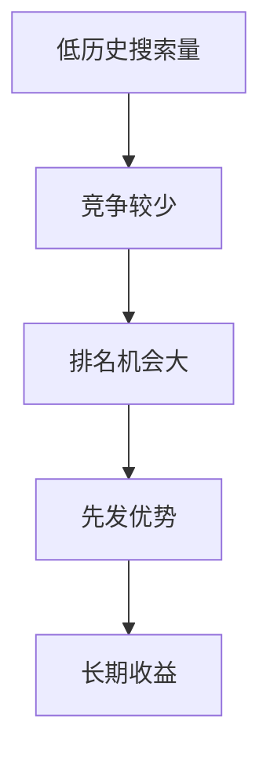
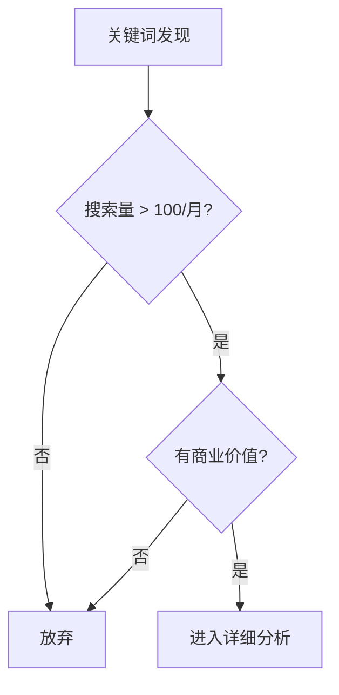
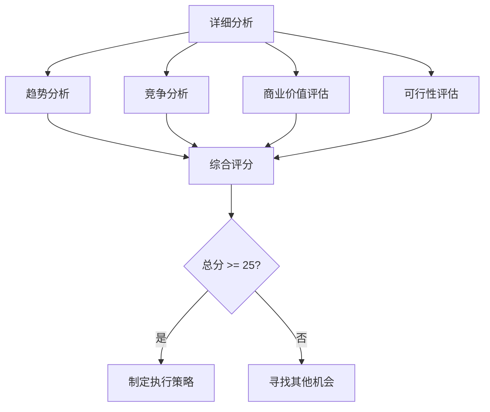

# 关键词网站建设决策框架分析

> 基于搜索趋势和竞争分析的网站建设决策逻辑评估  
> 创建时间：2024年12月  
> 分析目标：评估决策框架的合理性和背后的商业逻辑

---

## 📚 目录

- [🔍 决策框架概述](#-决策框架概述)
- [📈 搜索趋势分析部分](#-搜索趋势分析部分)
- [🏆 竞争分析部分](#-竞争分析部分)
- [✅ 框架优点分析](#-框架优点分析)
- [⚠️ 存在的问题](#️-存在的问题)
- [💡 优化建议](#-优化建议)
- [📋 完整决策模型](#-完整决策模型)

---

## 🔍 决策框架概述

### 原始决策流程
```
搜索趋势判断：
Q：七天和 30 天内是否陆续上涨？
A：是，则做

Q：9 个月和五年内是否没什么搜索量？
A：是，则做

搜索结果分析：
Q：谷歌搜索结果有没有图片
A：是，则不做

Q：有没有其他大网站
A：是则不做

Q：有没有已经人上线？
A：是，则不做
```

### 决策逻辑分类
1. **时间维度分析**: 短期趋势 + 长期历史
2. **竞争维度分析**: 内容形式 + 竞争对手 + 市场饱和度

---

## 📈 搜索趋势分析部分

### 判断1：七天和30天内是否陆续上涨？
```
答案：是，则做
```

#### ✅ 合理性分析
**优点：**
- **趋势捕捉**: 能够识别热门趋势和突发事件
- **时效性强**: 短期上涨表明当前关注度高
- **流量机会**: 可以快速获得搜索流量

**商业逻辑：**
- 抓住热点话题的流量红利
- 快速建站可以在竞争激烈前占据先机
- 短期ROI相对较高

#### ⚠️ 潜在问题
```javascript
// 风险评估
const shortTermRisks = {
    volatility: "短期热点可能快速消退",
    sustainability: "难以判断趋势是否可持续",
    qualityTraffic: "热点流量质量可能不高",
    resourceWaste: "可能浪费资源在昙花一现的话题上"
};
```

### 判断2：9个月和五年内是否没什么搜索量？
```
答案：是，则做
```

#### ✅ 合理性分析
**优点：**
- **蓝海机会**: 历史搜索量少意味着竞争较小
- **潜力挖掘**: 可能是新兴领域或被忽视的需求
- **长期布局**: 提前布局可能的未来热点

**商业逻辑：**


#### ⚠️ 潜在问题
- **需求验证**: 搜索量少可能意味着真实需求不足
- **变现困难**: 小众领域可能难以商业化
- **投入回报**: 可能投入大量时间但收效甚微

---

## 🏆 竞争分析部分

### 判断3：谷歌搜索结果有没有图片
```
答案：是，则不做
```

#### 🤔 合理性质疑

**问题分析：**
- **逻辑缺陷**: 有图片不一定意味着不应该做
- **误判风险**: 可能错过有价值的机会

**实际情况：**
```javascript
// 图片出现的不同情况
const imageScenarios = {
    goodSign: [
        "产品评测类关键词 - 用户需要看产品图片",
        "教程类关键词 - 图片有助于理解",
        "新闻类关键词 - 图片增加可信度"
    ],
    neutralSign: [
        "信息性关键词 - 图片和文字并重",
        "比较类关键词 - 图片有助于对比"
    ],
    concernSign: [
        "纯图片需求 - 用户主要寻找图片",
        "视觉导向 - 文字内容价值较低"
    ]
};
```

#### 💡 优化建议
**更合理的判断标准：**
1. **图片类型分析**: 区分产品图、信息图、装饰图
2. **内容机会**: 评估是否可以提供更好的图文结合内容
3. **用户意图**: 分析用户是否只要图片还是需要深度内容

### 判断4：有没有其他大网站
```
答案：是则不做
```

#### ✅ 部分合理性
**合理的考虑：**
- **竞争强度**: 大网站通常有更强的SEO能力
- **资源对比**: 个人或小团队难以与大公司竞争
- **风险控制**: 避免在红海市场浪费资源

#### ⚠️ 过于绝对化
**问题分析：**
```yaml
# 大网站存在时的机会分析
opportunities:
  niche_angle: "从细分角度切入，提供更专业的内容"
  user_experience: "提供更好的用户体验"
  content_depth: "深度内容弥补权威性不足"
  local_focus: "本地化内容优势"
  specialization: "专业化程度超越通用网站"
```

### 判断5：有没有已经人上线？
```
答案：是，则不做
```

#### 🚫 逻辑错误
**问题分析：**
- **过度保守**: 几乎所有有价值的关键词都有人在做
- **机会错失**: 可能错过可以做得更好的机会
- **竞争误解**: 有竞争不等于没有机会

**实际情况：**
```javascript
// 正确的竞争分析思路
const competitionAnalysis = {
    quantitative: {
        competitorCount: "竞争对手数量",
        contentQuality: "现有内容质量评分",
        domainAuthority: "竞争对手权威性",
        userSatisfaction: "用户满意度评估"
    },
    qualitative: {
        contentGaps: "内容空白点识别",
        differentiationOpportunity: "差异化机会",
        improvementPotential: "改进潜力评估"
    }
};
```

---

## ✅ 框架优点分析

### 1. **结构化思维**
- 提供了系统性的决策流程
- 涵盖了时间和竞争两个重要维度
- 有助于避免冲动性决策

### 2. **风险意识**
- 考虑了竞争强度
- 注重趋势分析
- 避免过度投入高竞争领域

### 3. **效率导向**
- 快速筛选机制
- 减少分析时间
- 聚焦高概率成功项目

---

## ⚠️ 存在的问题

### 1. **过度简化**
```python
# 问题示例
def current_logic(keyword):
    if has_images_in_serp(keyword):
        return "不做"  # 过于绝对
    if has_big_websites(keyword):
        return "不做"  # 忽略细分机会
    if has_any_competition(keyword):
        return "不做"  # 过度保守
    return "做"
```

### 2. **缺乏深度分析**
- 没有考虑内容质量差异
- 忽略了用户需求满足程度
- 缺少商业化潜力评估

### 3. **二元化思维**
- 只有"做"或"不做"两个选择
- 没有考虑不同的执行策略
- 缺乏灵活性

---

## 💡 优化建议

### 改进版决策框架

#### 1. **多维度评分系统**
```javascript
// 关键词评估模型
const keywordEvaluation = {
    // 趋势分析 (0-10分)
    trendAnalysis: {
        shortTermTrend: calculateShortTermScore(keyword),    // 短期趋势
        longTermPotential: calculateLongTermScore(keyword),  // 长期潜力
        seasonality: checkSeasonality(keyword),              // 季节性
        newsWorthiness: assessNewsValue(keyword)             // 新闻价值
    },
    
    // 竞争分析 (0-10分)
    competitionAnalysis: {
        competitorStrength: assessCompetitorStrength(keyword),
        contentQuality: evaluateExistingContent(keyword),
        marketSaturation: calculateSaturation(keyword),
        entryBarrier: assessEntryBarrier(keyword)
    },
    
    // 商业价值 (0-10分)
    commercialValue: {
        monetizationPotential: assessMonetization(keyword),
        audienceValue: calculateAudienceValue(keyword),
        conversionProbability: estimateConversion(keyword),
        lifetimeValue: calculateLTV(keyword)
    },
    
    // 执行可行性 (0-10分)
    feasibility: {
        resourceRequirement: assessResourceNeeds(keyword),
        timeToRank: estimateRankingTime(keyword),
        contentComplexity: evaluateContentComplexity(keyword),
        technicalRequirement: assessTechnicalNeeds(keyword)
    }
};
```

#### 2. **决策矩阵**
```yaml
# 基于总分的决策建议
decision_matrix:
  35-40分: 
    action: "优先执行"
    strategy: "投入主要资源，快速执行"
  25-34分:
    action: "考虑执行"  
    strategy: "制定详细计划，分阶段执行"
  15-24分:
    action: "观察机会"
    strategy: "持续监控，等待更好时机"
  0-14分:
    action: "暂不执行"
    strategy: "寻找其他机会"
```

#### 3. **动态调整机制**
```python
def dynamic_keyword_strategy(keyword, market_changes):
    """
    根据市场变化动态调整策略
    """
    current_score = evaluate_keyword(keyword)
    market_impact = assess_market_changes(market_changes)
    
    if market_impact.significant_opportunity:
        return "重新评估，可能上调优先级"
    elif market_impact.increased_competition:
        return "调整策略，考虑差异化角度"
    else:
        return "维持当前策略"
```

---

## 📋 完整决策模型

### 优化后的关键词评估流程

#### 阶段1：初步筛选


#### 阶段2：详细分析


#### 阶段3：策略制定
```yaml
execution_strategies:
  high_competition:
    approach: "细分角度切入"
    content: "深度专业内容"
    timeline: "长期投入"
    
  medium_competition:
    approach: "内容质量取胜"
    content: "全面优质内容"
    timeline: "中期规划"
    
  low_competition:
    approach: "快速占领"
    content: "基础但完整内容"
    timeline: "短期冲刺"
```

### 实用的评估问题清单

#### 📊 趋势评估
1. **短期趋势**（权重20%）
   - 最近30天搜索量变化？
   - 是否有明显上升趋势？
   - 是否与热点事件相关？

2. **长期潜力**（权重30%）
   - 是否属于增长行业？
   - 技术发展是否支持？
   - 用户行为是否在改变？

#### 🏆 竞争评估
1. **竞争强度**（权重25%）
   - 首页有几个权威网站？
   - 现有内容质量如何？
   - 我们能否做得更好？

2. **差异化机会**（权重15%）
   - 是否有未被满足的用户需求？
   - 能否从新角度切入？
   - 有哪些内容空白点？

#### 💰 商业价值
1. **变现潜力**（权重10%）
   - 用户购买意图强度？
   - 可用的变现模式？
   - 预估单用户价值？

---

## 📋 总结

### 🎯 原框架评价
**合理之处：**
- ✅ 关注趋势变化
- ✅ 考虑竞争强度
- ✅ 提供快速筛选机制

**主要问题：**
- ❌ 过度简化复杂决策
- ❌ 二元化思维模式
- ❌ 缺乏深度分析
- ❌ 忽略执行策略差异

### 💡 关键洞察
1. **竞争不等于没有机会** - 关键在于能否做得更好
2. **图片存在有多种含义** - 需要具体分析用户意图
3. **历史数据只是参考** - 更重要的是未来潜力
4. **决策应该是动态的** - 随市场变化而调整

### 🚀 最佳实践
1. **使用评分系统**而非二元判断
2. **考虑执行策略差异**而非一刀切
3. **持续监控调整**而非一次性决策
4. **关注用户价值**而非单纯竞争分析

正确的关键词决策应该基于**数据驱动、多维评估、策略灵活**的原则，而不是简单的是否判断。

---
*文档创建时间: 2024年12月*  
*基于SEO和内容营销最佳实践整理* 