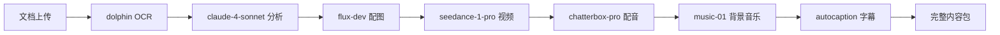
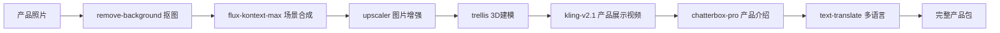
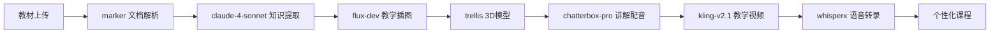
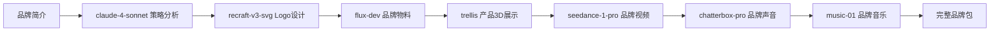
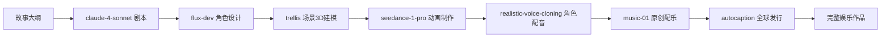
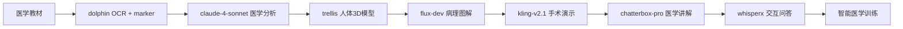
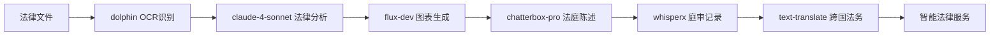

# 基于Replicate API的创意网站项目集

## 📋 概述

本文档收集了基于Replicate AI模型API的创意网站项目想法，涵盖图像生成、视频制作、音频处理、商业工具等多个领域。每个项目都包含具体的技术实现方案、商业模式和目标用户分析。

---

## 🎨 **图像生成类网站**

### **1. AI品牌设计师** - BrandAI.com

**🎯 核心功能：**
- Logo设计：使用 `recraft-v3-svg` 生成专业Logo
- 品牌物料：使用 `flux-dev` 生成名片、包装设计
- 营销海报：使用 `ideogram-v3-quality` 生成品牌海报

**👥 目标用户：**创业者、小企业主、自由职业者
**💰 盈利模式：**按设计套餐付费 $10-50/套
**⏱️ 开发周期：**2-3周
**💡 技术特点：**SVG矢量输出，支持品牌色彩定制

---

### **2. AI房产装修助手** - HomeVisualizer.ai

**🎯 核心功能：**
- 装修预览：使用 `flux-kontext-pro` 编辑房间装修风格
- 3D效果：使用 `trellis` 生成3D房间效果图
- 风格转换：现代、欧式、中式等多种风格切换

**👥 目标用户：**房产中介、装修公司、业主
**💰 盈利模式：**B2B授权 $200/月/企业 + C端按次收费
**⏱️ 开发周期：**4-6周
**💡 技术特点：**实景照片编辑，3D可视化

---

### **3. AI产品摄影工厂** - ProductShoot.ai

**🎯 核心功能：**
- 背景替换：使用 `flux-kontext-max` 添加专业背景
- 图片增强：使用 `upscaler` 提升图片质量
- 批量处理：支持批量产品图片处理

**👥 目标用户：**电商卖家、品牌方、摄影工作室
**💰 盈利模式：**积分制 $0.5-2/张图片
**⏱️ 开发周期：**3-4周
**💡 技术特点：**电商优化，批量处理能力

---

## 🎬 **视频内容类网站**

### **4. AI短视频工厂** - ViralClips.ai

**🎯 核心功能：**
- 视频生成：使用 `seedance-1-pro` 生成短视频
- 自动字幕：使用 `autocaption` 添加字幕
- 背景音乐：使用 `music-01` 生成配乐

**👥 目标用户：**内容创作者、营销团队、自媒体
**💰 盈利模式：**订阅制 $29/月无限制
**⏱️ 开发周期：**6-8周
**💡 技术特点：**一键生成，适配各平台尺寸

---

### **5. AI课程制作平台** - EduVideoAI.com

**🎯 核心功能：**
- 课件生成：使用 `flux-dev` 生成教学图片
- 旁白配音：使用 `chatterbox-pro` 生成专业旁白
- 演示视频：使用 `kling-v2.1` 制作操作演示

**👥 目标用户：**在线教育机构、培训师、教师
**💰 盈利模式：**按课程付费 $50-200/门课程
**⏱️ 开发周期：**8-10周
**💡 技术特点：**教育场景优化，多语言支持

---

### **6. AI个人传记视频** - MyStoryAI.com

**🎯 核心功能：**
- 照片修复：使用 `codeformer` 修复老照片
- 声音克隆：使用 `realistic-voice-cloning` 克隆声音
- 对话视频：使用 `multitalk` 生成互动对话

**👥 目标用户：**家庭用户、纪念品制作、老年群体
**💰 盈利模式：**按视频收费 $20-100/个
**⏱️ 开发周期：**5-7周
**💡 技术特点：**情感化设计，家庭场景优化

---

## 🎵 **音频娱乐类网站**

### **7. AI音乐创作室** - BeatMaker.ai

**🎯 核心功能：**
- 音乐生成：使用 `musicgen` 生成原创音乐
- 音调修正：使用 `auto-tune` 修正用户录音
- 歌词演唱：使用 `speech-02-hd` 生成歌声

**👥 目标用户：**音乐爱好者、独立音乐人、短视频创作者
**💰 盈利模式：**订阅制 $19/月 + 单首购买 $2-5
**⏱️ 开发周期：**4-6周
**💡 技术特点：**音乐版权保护，多风格生成

---

### **8. AI播客助手** - PodcastAI.pro

**🎯 核心功能：**
- 语音转录：使用 `incredibly-fast-whisper` 转录语音
- 多角色对话：使用 `chatterbox-pro` 生成对话
- 音效制作：使用 `music-01` 生成背景音乐

**👥 目标用户：**播客主播、媒体公司、内容创作者
**💰 盈利模式：**按集数收费 $5-20/集
**⏱️ 开发周期：**3-5周
**💡 技术特点：**播客优化，多平台发布

---

## 🏢 **商业工具类网站**

### **9. AI文档处理中心** - DocuMagic.ai

**🎯 核心功能：**
- 文字提取：使用 `dolphin` OCR提取文档文字
- 内容分析：使用 `claude-4-sonnet` 分析文档
- 配图生成：使用 `flux-dev` 生成文档配图

**👥 目标用户：**律师事务所、会计公司、企业办公
**💰 盈利模式：**按页收费 $0.1-0.5/页
**⏱️ 开发周期：**4-6周
**💡 技术特点：**企业级安全，批量处理

---

### **10. AI客服视频助手** - CustomerAI.video

**🎯 核心功能：**
- 声音克隆：使用 `realistic-voice-cloning` 克隆客服声音
- 讲解视频：使用 `multitalk` 生成客服视频
- 多语言字幕：使用 `autocaption` 添加字幕

**👥 目标用户：**电商平台、SaaS公司、客服中心
**💰 盈利模式：**按视频数量 $200/月/100个视频
**⏱️ 开发周期：**6-8周
**💡 技术特点：**企业定制，多语言支持

---

## 🎯 **娱乐社交类网站**

### **11. AI变装秀** - StyleSwap.fun

**🎯 核心功能：**
- 虚拟换装：使用 `flux-kontext-pro` 实现换装效果
- 换装视频：使用 `seedance-1-lite` 生成动态视频
- 角色配音：使用 `realistic-voice-cloning` 配音

**👥 目标用户：**年轻用户、娱乐玩家、社交媒体用户
**💰 盈利模式：**内购 + 广告收入
**⏱️ 开发周期：**5-7周
**💡 技术特点：**娱乐化设计，社交分享

---

### **12. AI宠物明星** - PetStar.ai

**🎯 核心功能：**
- 宠物卡通化：使用 `flux-dev` 生成宠物卡通形象
- 宠物短剧：使用 `seedance-1-pro` 制作宠物视频
- 主题音乐：使用 `musicgen` 配宠物音乐

**👥 目标用户：**宠物主人、宠物博主、家庭用户
**💰 盈利模式：**订阅制 $9.9/月
**⏱️ 开发周期：**4-6周
**💡 技术特点：**宠物识别，可爱风格

---

## 🌐 **综合平台类网站**

### **13. AI创意工厂** - CreativeHub.ai

**🎯 核心功能：**
- **图片模块**：Logo、海报、产品图
- **视频模块**：短视频、广告、教程
- **音频模块**：配音、音乐、音效
- **3D模块**：产品建模、场景设计

**👥 目标用户：**创意代理商、营销团队、自媒体
**💰 盈利模式：**积分制 + 企业年费 $500-2000/年
**⏱️ 开发周期：**12-16周
**💡 技术特点：**一站式解决方案，工作流自动化

---

### **14. AI时光机** - TimeMachine.ai

**🎯 核心功能：**
- 照片修复：使用 `bringing-old-photos-back-to-life` 修复老照片
- 照片上色：使用 `ddcolor` 给黑白照片上色
- 历史配音：使用 `realistic-voice-cloning` 重现历史声音
- 历史对话：使用 `multitalk` 制作历史人物对话

**👥 目标用户：**博物馆、教育机构、家庭用户
**💰 盈利模式：**B2B授权 + C端付费内容
**⏱️ 开发周期：**8-12周
**💡 技术特点：**历史主题，教育价值

---

## 🚀 **多API组合高级项目**

*以下项目充分利用Replicate平台多种AI模型的组合，创造更强大、更有价值的应用场景*

---

### **15. AI内容工厂流水线** - ContentPipeline.ai

**🔗 API组合流程：**


**🎯 核心功能：**
- **文档解析**：`dolphin` OCR提取 → `claude-4-sonnet` 内容分析优化
- **视觉生成**：`flux-dev` 配图生成 → `upscaler` 图片增强
- **视频制作**：`seedance-1-pro` 视频生成 → `modify-video` 风格调整
- **音频处理**：`chatterbox-pro` 专业配音 → `music-01` 背景音乐
- **后期制作**：`autocaption` 多语言字幕 → `addwatermark` 版权保护

**👥 目标用户：**媒体公司、教育机构、企业培训、内容代理商
**💰 盈利模式：**按内容包收费 $100-500/套完整内容
**⏱️ 开发周期：**12-16周
**💡 技术特点：**全自动内容生产流水线，一键生成完整多媒体包

---

### **16. AI电商全能助手** - EcommerceAI.store

**🔗 API组合流程：**


**🎯 核心功能：**
- **图片处理链**：`remove-background` 抠图 → `flux-kontext-max` 场景合成 → `upscaler` 质量提升
- **3D展示**：`trellis` 3D产品建模 → `kling-v2.1` 360度展示视频
- **营销素材**：`gen4-image` 参考图生成 → `seedance-1-pro` 广告视频制作
- **多语言推广**：`chatterbox-pro` 多语言配音 → `text-translate` 文案翻译 → `autocaption` 字幕
- **品牌升级**：`recraft-v3-svg` Logo优化 → `flux-dev` 包装设计

**👥 目标用户：**电商卖家、品牌方、跨境电商、产品设计师
**💰 盈利模式：**SaaS订阅 $99/月 + 按产品收费 $10-50/个
**⏱️ 开发周期：**14-18周
**💡 技术特点：**电商全链条解决方案，支持批量处理

---

### **17. AI智能教育平台** - EduGenius.ai

**🔗 API组合流程：**


**🎯 核心功能：**
- **智能解析**：`marker` 教材文档解析 → `claude-4-sonnet` 知识点提取和重组
- **可视化教学**：`flux-dev` 概念插图生成 → `trellis` 3D立体模型 → `ideogram-v3-quality` 图表制作
- **多媒体课件**：`chatterbox-pro` 个性化配音 → `kling-v2.1` 动画演示 → `music-01` 学习背景音
- **互动功能**：`whisperx` 语音识别测试 → `multitalk` 虚拟师生对话
- **多语言支持**：`text-translate` 课程翻译 → `autocaption` 字幕生成

**👥 目标用户：**K12学校、在线教育平台、培训机构、个人教师
**💰 盈利模式：**B2B年费 $2000-10000/机构 + C端课程费 $50-200/门
**⏱️ 开发周期：**16-20周
**💡 技术特点：**个性化学习路径，AI虚拟教师

---

### **18. AI企业品牌自动化工厂** - BrandFactory.ai

**🔗 API组合流程：**


**🎯 核心功能：**
- **品牌策略**：`claude-4-sonnet` 品牌定位分析 → 竞品分析 → 差异化策略
- **视觉系统**：`recraft-v3-svg` Logo设计 → `flux-dev` 品牌色彩应用 → `ideogram-v3-quality` 营销物料
- **3D展示**：`trellis` 产品3D建模 → `kling-v2.1` 产品演示视频
- **声音品牌**：`realistic-voice-cloning` 品牌代言人声音 → `music-01` 品牌音乐DNA
- **营销视频**：`seedance-1-pro` 品牌故事视频 → `autocaption` 多语言推广

**👥 目标用户：**新创企业、品牌咨询公司、营销代理商、中小企业
**💰 盈利模式：**完整品牌包 $2000-20000/套 + 月度更新服务
**⏱️ 开发周期：**12-16周
**💡 技术特点：**企业级品牌解决方案，一站式品牌构建

---

### **19. AI娱乐内容宇宙** - EntertainmentUniverse.ai

**🔗 API组合流程：**


**🎯 核心功能：**
- **内容创作**：`claude-4-sonnet` 剧本创作 → 角色对话生成 → 情节发展
- **视觉设计**：`flux-dev` 角色概念设计 → `ideogram-v3-quality` 场景原画 → `trellis` 3D环境建模
- **动画制作**：`seedance-1-pro` 角色动画 → `kling-v2.1` 场景动画 → `modify-video` 特效合成
- **音频制作**：`realistic-voice-cloning` 角色专属声音 → `music-01` 情景音乐 → `auto-tune` 音效处理
- **全球发布**：`autocaption` 多语言字幕 → `text-translate` 本地化适配

**👥 目标用户：**动画工作室、独立创作者、流媒体平台、游戏公司
**💰 盈利模式：**作品授权 + 制作服务 $5000-50000/项目
**⏱️ 开发周期：**20-24周
**💡 技术特点：**完整娱乐内容制作流水线，IP孵化平台

---

### **20. AI医疗教学模拟器** - MedEduSimulator.ai

**🔗 API组合流程：**


**🎯 核心功能：**
- **知识处理**：`dolphin` + `marker` 医学文献解析 → `claude-4-sonnet` 医学知识图谱构建
- **3D可视化**：`trellis` 人体器官3D建模 → 病理变化可视化 → 手术操作模拟
- **教学内容**：`flux-dev` 医学插图生成 → `ideogram-v3-quality` 病理图解
- **互动培训**：`kling-v2.1` 手术操作视频 → `multitalk` 医患对话模拟
- **语音交互**：`whisperx` 医学问答系统 → `chatterbox-pro` 标准医学发音

**👥 目标用户：**医学院校、医院培训部门、医疗器械公司
**💰 盈利模式：**B2B授权 $10000-100000/年 + 定制开发
**⏱️ 开发周期：**24-30周
**💡 技术特点：**专业医学场景，高精度3D建模

---

### **21. AI法律文书智能助手** - LegalAI.assistant

**🔗 API组合流程：**


**🎯 核心功能：**
- **文档处理**：`dolphin` 法律文件OCR → `marker` 合同条款提取 → `claude-4-sonnet` 法律风险分析
- **可视化**：`flux-dev` 法律关系图表 → `ideogram-v3-quality` 证据展示图
- **音频服务**：`chatterbox-pro` 法庭陈述练习 → `whisperx` 庭审记录转录
- **国际法务**：`text-translate` 法律文件翻译 → 跨国法律合规检查
- **智能问答**：法律条文查询 → 案例匹配 → 法律建议生成

**👥 目标用户：**律师事务所、企业法务、法院系统、法学院
**💰 盈利模式：**SaaS订阅 $500-2000/月 + 按案件收费
**⏱️ 开发周期：**16-20周
**💡 技术特点：**法律专业性强，合规性要求高

---

## 🛠️ **多API组合项目技术架构**

### **核心技术挑战：**

**🔧 API编排管理**
- **挑战：**多API调用顺序和依赖管理
- **解决方案：**工作流引擎 + 状态机管理

**💰 成本优化控制**
- **挑战：**多API组合使用成本控制
- **解决方案：**智能缓存 + 批处理 + 成本预算监控

**⚠️ 错误处理机制**
- **挑战：**单个API失败影响整个流程
- **解决方案：**降级策略 + 重试机制 + 备用方案

**⚡ 性能优化**
- **挑战：**多API串行调用响应时间长
- **解决方案：**并行处理 + 异步队列 + 进度显示

### **推荐架构模式：**
**🏗️ 工作流引擎架构**：基于状态机的API编排系统
**📊 结果管理**：统一的结果收集和处理机制
**🔄 并行处理**：智能识别可并行执行的步骤
**📈 进度追踪**：实时进度更新和状态反馈

### **成本控制策略：**
**💾 智能缓存**：多层缓存减少重复API调用（节省40-60%）
**📦 批量处理**：批量处理降低API调用频率（节省20-30%）
**🎯 API选择**：根据质量需求选择合适的API（预览用flux-schnell，最终用flux-dev）
**📊 预算监控**：实时成本监控和预算控制（成本预警、使用量限制、动态定价）

---

## 📊 **多API项目投资回报分析**

| 项目类型 | 开发成本 | 月运营成本 | 预期月收入 | 投资回报期 | 市场潜力 |
|----------|----------|------------|------------|------------|----------|
| **内容工厂流水线** | $50,000-80,000 | $2,000-8,000 | $20,000-100,000 | 6-12个月 | 🔥🔥🔥🔥🔥 |
| **电商全能助手** | $40,000-70,000 | $1,500-6,000 | $15,000-80,000 | 6-10个月 | 🔥🔥🔥🔥🔥 |
| **智能教育平台** | $60,000-100,000 | $2,500-10,000 | $25,000-150,000 | 8-15个月 | 🔥🔥🔥🔥 |
| **企业品牌工厂** | $35,000-60,000 | $1,000-4,000 | $10,000-50,000 | 5-8个月 | 🔥🔥🔥🔥 |
| **娱乐内容宇宙** | $80,000-120,000 | $3,000-15,000 | $30,000-200,000 | 10-18个月 | 🔥🔥🔥 |
| **医疗教学模拟器** | $100,000-150,000 | $4,000-20,000 | $50,000-300,000 | 12-24个月 | 🔥🔥🔥 |

### **关键成功因素：**
1. **技术架构**：稳定的多API调用管理
2. **用户体验**：简化复杂流程的界面设计
3. **成本控制**：智能化的API使用优化
4. **市场定位**：明确的目标用户和价值主张
5. **可扩展性**：支持业务快速增长的架构

---

*多API组合项目更新时间：2024年12月*  
*基于Replicate平台的复合AI解决方案*

---

*文档创建时间：2024年12月*  
*基于Replicate API的创意项目集合*

---

## 🔰 **技术小白友好项目（2-3个API）**

*以下项目专为初学者设计，使用2-3个API组合，技术难度低，易于实现*

---

### **22. AI头像制作工具** - AvatarMaker.fun

**🔗 API组合（2个）：**
```javascript
用户照片 → flux-kontext-pro图像编辑 → upscaler图像增强 → 精美头像
```

**🎯 核心功能：**
- **头像美化**：使用 `flux-kontext-pro` 美化用户照片
- **质量提升**：使用 `upscaler` 提升图片分辨率

**👥 目标用户：**社交媒体用户、求职者、学生
**💰 盈利模式：**按张收费 $2-5/张
**⏱️ 开发周期：**1-2周
**💡 技术特点：**流程简单，成功率高，用户需求明确

**💻 技术实现：**两步式API调用流程，先美化后增强，适合初学者掌握

---

### **23. AI产品介绍视频生成器** - ProductIntro.ai

**🔗 API组合（3个）：**
```javascript
产品图片 → flux-dev背景美化 → seedance-1-lite视频生成 → chatterbox-pro配音 → 产品视频
```

**🎯 核心功能：**
- **图片美化**：使用 `flux-dev` 为产品图片添加专业背景
- **视频生成**：使用 `seedance-1-lite` 生成产品展示视频
- **语音介绍**：使用 `chatterbox-pro` 生成产品介绍配音

**👥 目标用户：**小企业主、电商卖家、创业者
**💰 盈利模式：**按视频收费 $10-30/个
**⏱️ 开发周期：**2-3周
**💡 技术特点：**电商场景明确，市场需求大

**💻 技术实现：**三步式API调用流程，图片美化→视频生成→配音合成，适合电商场景

---

### **24. AI简历美化助手** - ResumeBooster.ai

**🔗 API组合（3个）：**
```javascript
简历文档 → dolphin OCR提取 → claude-4-sonnet优化 → flux-dev排版设计 → 精美简历
```

**🎯 核心功能：**
- **内容提取**：使用 `dolphin` OCR识别简历文字
- **内容优化**：使用 `claude-4-sonnet` 优化简历内容
- **视觉设计**：使用 `flux-dev` 生成现代化简历排版

**👥 目标用户：**求职者、应届毕业生、职场人士
**💰 盈利模式：**按份收费 $5-15/份
**⏱️ 开发周期：**2-3周
**💡 技术特点：**刚需场景，复购率高

---

### **25. AI音乐MV制作器** - MusicVideoMaker.ai

**🔗 API组合（3个）：**
```javascript
音乐文件 → whisperx分析节拍 → flux-dev生成画面 → kling-v2.1制作MV → 音乐视频
```

**🎯 核心功能：**
- **音乐分析**：使用 `whisperx` 分析音乐节拍和情感
- **画面生成**：使用 `flux-dev` 根据音乐生成对应画面
- **视频合成**：使用 `kling-v2.1` 制作完整MV

**👥 目标用户：**音乐爱好者、独立音乐人、短视频创作者
**💰 盈利模式：**按MV收费 $20-50/个
**⏱️ 开发周期：**3-4周
**💡 技术特点：**创意性强，分享传播性好

---

### **26. AI老照片修复工具** - PhotoRestore.ai

**🔗 API组合（2个）：**
```javascript
老照片 → bringing-old-photos-back-to-life修复 → ddcolor上色 → 修复完成照片
```

**🎯 核心功能：**
- **照片修复**：使用 `bringing-old-photos-back-to-life` 修复损坏照片
- **照片上色**：使用 `ddcolor` 为黑白照片上色

**👥 目标用户：**家庭用户、老年群体、摄影爱好者
**💰 盈利模式：**按张收费 $3-10/张
**⏱️ 开发周期：**1-2周
**💡 技术特点：**情感价值高，口碑传播强

---

## 🛠️ **多API调用技术方案**

### **1. 基础串行调用（适合新手）**
**📝 实现方式：**简单的顺序调用方式，使用循环依次执行每个API
**🎯 适用场景：**初学者学习、简单的2-3个API组合项目
**⚡ 特点：**代码简单、易于理解、调试方便

### **2. 带进度显示的调用（用户友好）**
**📝 实现方式：**在基础调用基础上增加进度回调机制
**🎯 适用场景：**用户需要了解处理进度的场景
**⚡ 特点：**用户体验好、实时反馈、透明度高

### **3. 并行处理优化（提升性能）**
**📝 实现方式：**分析API依赖关系，将无依赖的步骤并行执行
**🎯 适用场景：**复杂工作流、性能要求高的场景
**⚡ 特点：**执行速度快、资源利用率高、技术复杂度中等

### **4. 错误处理和重试机制（生产环境）**
**📝 实现方式：**增加超时控制、重试机制、降级策略
**🎯 适用场景：**生产环境、高可用性要求
**⚡ 特点：**稳定性高、容错性强、自动恢复

---

## ⚙️ **工作流引擎详解**

### **什么是工作流引擎？**

工作流引擎是一个**自动化管理多个API调用序列**的系统。它就像一个"任务调度员"，负责：

1. **任务编排**：决定API调用的顺序和依赖关系
2. **状态管理**：跟踪每个步骤的执行状态
3. **错误处理**：处理失败和重试逻辑
4. **资源优化**：并行执行和缓存管理

### **工作流引擎核心功能**

**🔧 核心组件：**
- **工作流定义器**：配置API调用步骤和依赖关系
- **执行引擎**：按序执行工作流步骤，管理状态转换
- **进度跟踪器**：实时跟踪执行进度，提供状态回调
- **错误处理器**：处理API调用失败，提供重试和降级

**📊 状态管理：**
- **待执行（pending）**：工作流已定义，等待执行
- **运行中（running）**：正在执行某个步骤
- **已完成（completed）**：所有步骤成功完成
- **失败（failed）**：某个步骤执行失败

### **工作流引擎的优势**

1. **简化开发**：不需要手写复杂的API调用链
2. **可重用性**：一次定义，多次使用
3. **可维护性**：工作流和业务逻辑分离
4. **可监控性**：详细的执行日志和状态跟踪
5. **可扩展性**：容易添加新的步骤和功能

这样您就可以从最简单的2个API项目开始，逐步掌握多API调用的技术！ 